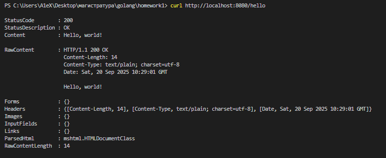
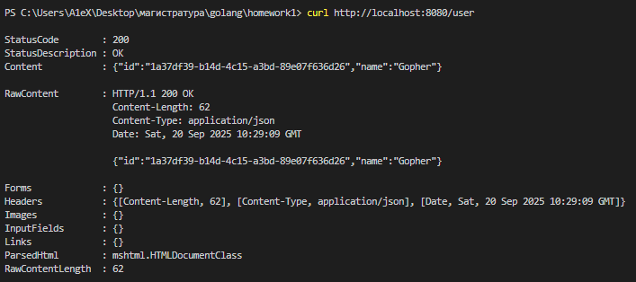
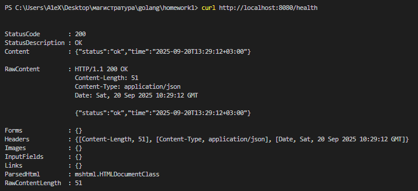

# Практическое занятие №1

## Тема: Установка и настройка окружения Go

**Студент:** Наумов А.Е.
**Группа:** ЭФМО-01-25

### Запуск
1. Клонирование репозитория
```bash
git clone git@github.com:d1vide/golang.git
```
2. Переход в директорию проекта 
```bash
cd homework1/helloapi/
```
3. Запуск приложения
   3.1. Запуск через `go run`
   ```bash
   go run ./cmd/server
   ```
   3.2. Запуск через `exe` файл
   Для сборки exe (необязательно)
    ```bash
    go build -o helloapi.exe ./cmd/server
    ```
    Для запуска файла
    ```bash
    ./helloapi.exe
    ```
# Описание проекта:
Простой HTTP API сервер на Go, предоставляющий базовые эндпоинты.
## Примеры запросов:
### 1. GET /hello
`curl http://localhost:8080/hello`

### 2. GET /user
`curl http://localhost:8080/user`

### 3. GET /health
`curl http://localhost:8080/health`

# Структура проекта:
```
──helloapi
    │   go.mod
    │   go.sum
    │   helloapi.exe
    │   README.md
    │
    └───cmd
        └───server
                main.go
```
# Конфигурация
### Переменные окружения:
APP_PORT - порт для запуска сервера (по умолчанию: 8080)
Пример настройки порта для Linux:
```bash
export APP_PORT=3333
```

Сервер будет доступен по адресу: `http://localhost:PORT`