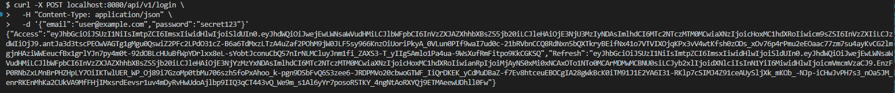
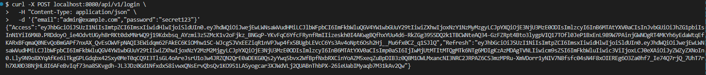
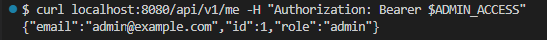
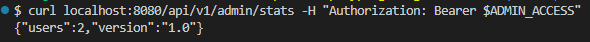
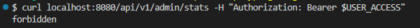
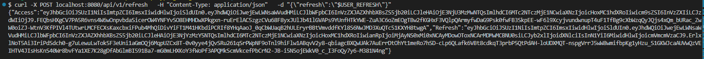

# Практическое занятие №10

## Тема: JWT-аутентификация: создание и проверка токенов. Middleware для авторизации

**Студент:** Наумов А.Е.
**Группа:** ЭФМО-01-25

## Краткое описание
В проекте реализован API-сервер на Go с аутентификацией и авторизацией на основе JWT:

- Access/Refresh: при логине выдаются два токена - короткоживущий access (15 минут) и долгоживущий refresh (7 дней).

- Refresh endpoint: `POST /api/v1/refresh` принимает refresh-токен, проверяет его валидность и выдаёт новую пару токенов, при этом старый refresh токен заносится в blacklist.

- ABAC: пользователь с ролью user может обращаться к `/api/v1/users/{id}` только если {id} совпадает с sub из токена; admin имеет доступ ко всем маршрутам, включая `/api/v1/admin/stats`.

- RS256 используется для подписи JWT, обеспечивая асимметричную криптографию с приватным ключом для подписи и публичным для верификации, с поддержкой kid для ротации ключей.


## Примеры запросов

- успешный /login (токен)

```bash
curl -X POST localhost:8080/api/v1/login \
  -H "Content-Type: application/json" \
  -d '{"email":"user@example.com","password":"secret123"}'
```







- /me и /admin/stats для admin

```bash
ADMIN_ACCESS=<ADMIN_TOKEN>
curl localhost:8080/api/v1/me -H "Authorization: Bearer $ADMIN_ACCESS"
curl localhost:8080/api/v1/admin/stats -H "Authorization: Bearer $ADMIN_ACCESS"
```





- 403 для user на /admin/stats

```bash
USER_ACCESS=<USER_TOKEN>
curl localhost:8080/api/v1/admin/stats -H "Authorization: Bearer $USER_ACCESS"
```



- refresh-флоу (старый/новый access)

```bash
curl -X POST localhost:8080/api/v1/refresh   -H "Content-Type: application/json"   -d "{\"refresh\":\"$USER_REFRESH\"}"
```




## Переменные окружения
`export APP_PORT=8080`