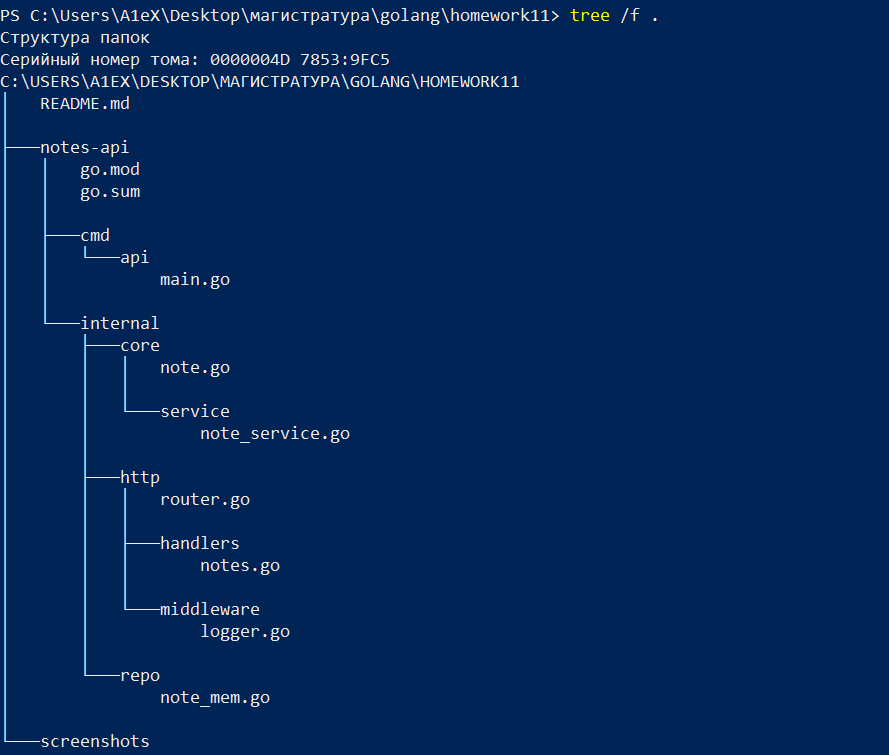
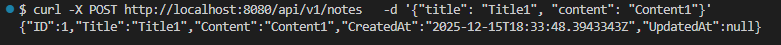
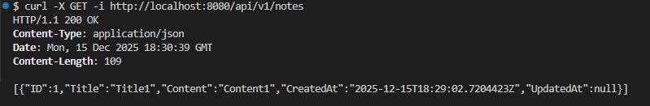
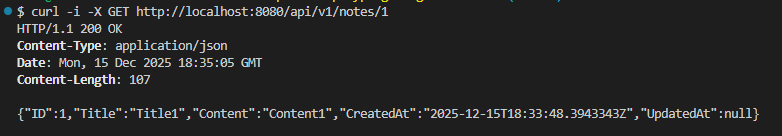
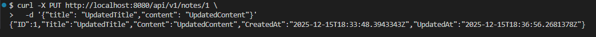
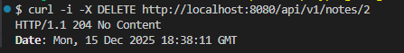
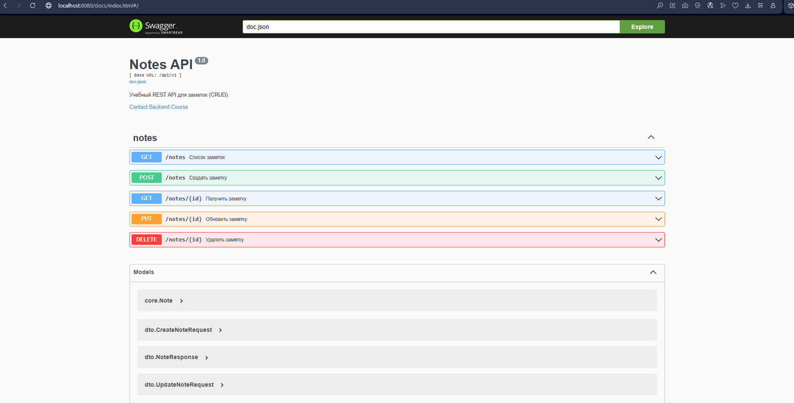
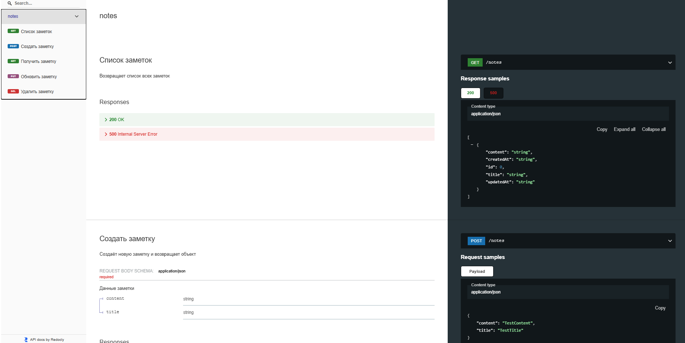
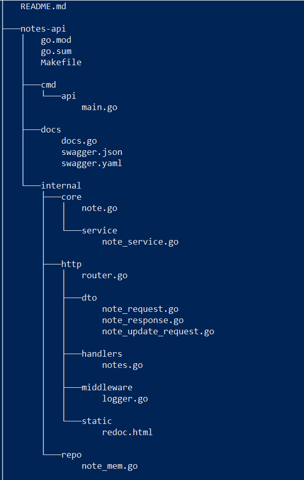

# Практическое занятие №11

## Тема: Проектирование REST API (CRUD для заметок). Разработка структуры

**Студент:** Наумов А.Е.
**Группа:** ЭФМО-01-25


**Цели работы**
1.	Освоить принципы проектирования REST API.
2.	Научиться разрабатывать структуру проекта backend-приложения на Go.
3.	Спроектировать и реализовать CRUD-интерфейс (Create, Read, Update, Delete) для сущности «Заметка».
4.	Освоить применение слоистой архитектуры (handler → service → repository).
5.	Подготовить основу для интеграции с базой данных и JWT-аутентификацией в следующих занятиях.


### Теоретические положения REST API
Принципы REST API

Клиент-серверная архитектура:
Четкое разделение ролей, клиент запрашивает данные, сервер их предоставляет, что позволяет им развиваться независимо.

Отсутствие состояния:
Каждый запрос от клиента содержит всю необходимую информацию, сервер не хранит состояние между запросами.

Кэшируемость:
Ответы могут быть помечены как кэшируемые, что позволяет клиентам или посредникам хранить их, снижая нагрузку на сервер.

Единый интерфейс:
Стандартизированный способ взаимодействия с ресурсами через URI и стандартные методы (GET, POST итд).

Многоуровневая система:
Клиент не знает, подключен ли он напрямую к серверу или через промежуточные уровни (кэши, прокси), что повышает гибкость.

### Структура созданного проекта



### Примеры запросов

- POST `/api/v1/notes`

```bash
curl -X POST http://localhost:8080/api/v1/notes \
  -d '{"title": "Title1", "content": "Content1"}'
```



- GET `/api/v1/notes`
```bash
curl -X GET http://localhost:8080/api/v1/notes
```




- GET `/api/v1/notes/{id}`
```bash
curl -X GET http://localhost:8080/api/v1/notes/1
```



- PUT `/api/v1/notes/{id}`
```bash
curl -X PUT http://localhost:8080/api/v1/notes/1 \
  -d '{"title": "UpdatedTitle","content": "UpdatedContent"}'
```



- DELETE `/api/v1/notes/{id}`
```bash
curl -X DELETE http://localhost:8080/api/v1/notes/1
```




# Практическое занятие №12

## Тема: Подключение Swagger/OpenAPI. Автоматическая генерация документации

### Цель работы:
1.	Освоить основы спецификации OpenAPI (Swagger) для REST API.
2.	Подключить автогенерацию документации к проекту из ПЗ 11 (notes-api).
3.	Научиться публиковать интерактивную документацию (Swagger UI / ReDoc) на эндпоинте GET /docs.
4.	Синхронизировать код и спецификацию (комментарии-аннотации → генерация) и/или «schema-first» (генерация кода из openapi.yaml).
5.	Подготовить процесс обновления документации (Makefile/скрипт).


Code-First: пишем код API с аннотациями -> генерация OpenAPI автоматически.

Плюсы: быстро подключить к проекту, мало ручной работы, актуально при изменениях.

Минусы: ограничена гибкость, возможны расхождения с кодом.


### Пример аннотации для `CreateNote`
```go
// CreateNote godoc
// @Summary      Создать заметку
// @Description  Создаёт новую заметку и возвращает объект
// @Tags         notes
// @Accept       json
// @Produce      json
// @Param        note  body      dto.CreateNoteRequest  true  "Данные заметки"
// @Success      201   {object}  dto.NoteResponse
// @Failure      400   {object}  map[string]string
// @Failure      500   {object}  map[string]string
// @Router       /notes [post]
```

### Пример аннотации для `GetNotes`
```go
// GetNotes godoc
// @Summary      Список заметок
// @Description  Возвращает список всех заметок
// @Tags         notes
// @Produce      json
// @Success      200  {array}   core.Note
// @Failure      500  {object}  map[string]string
// @Router       /notes [get]
```

### Swagger UI



### ReDoc



### Команда генерации документации 
```
swag init -g cmd/api/main.go -o docs
```

### Дерево проекта

