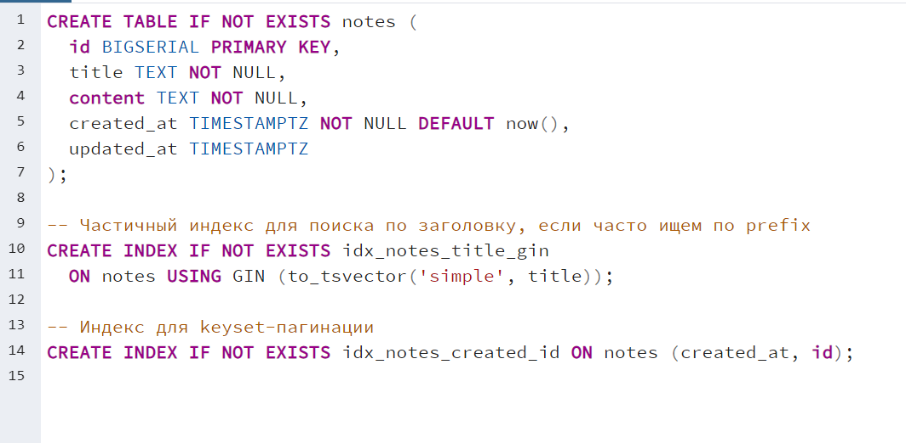
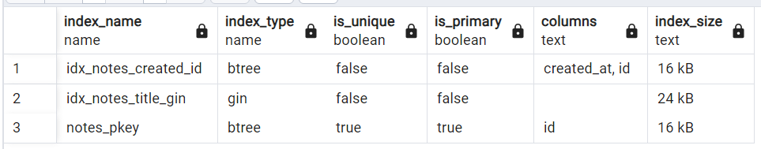
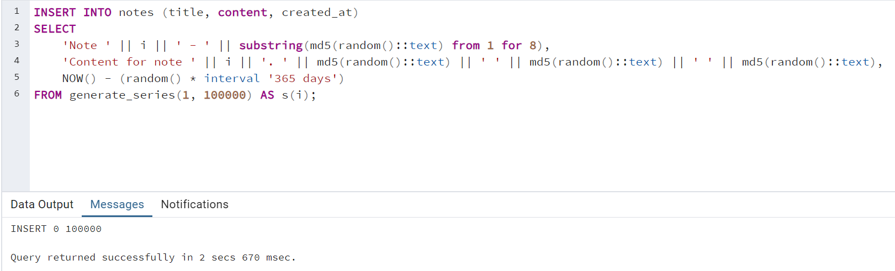
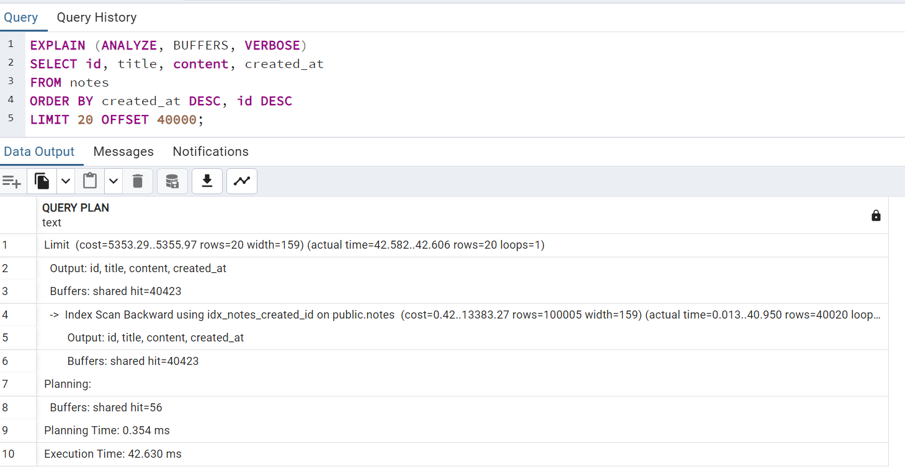
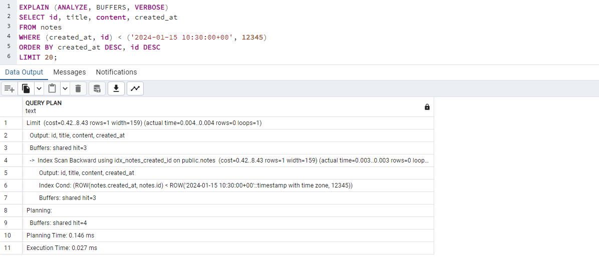
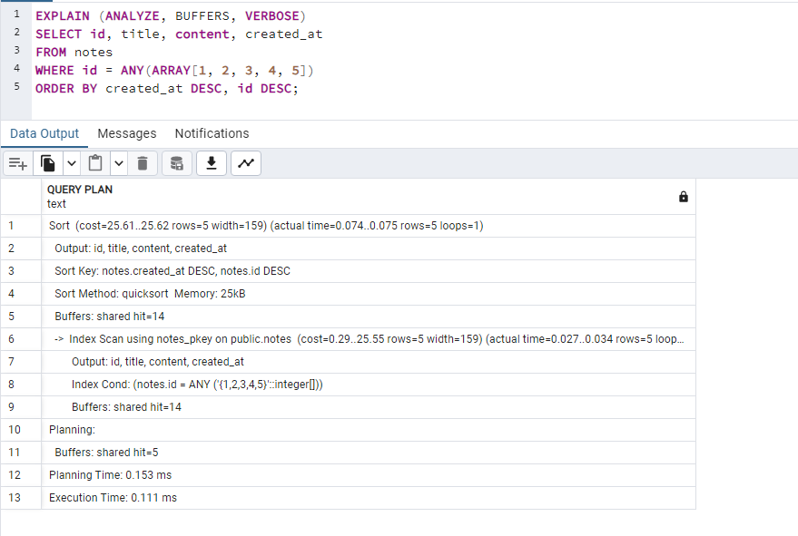
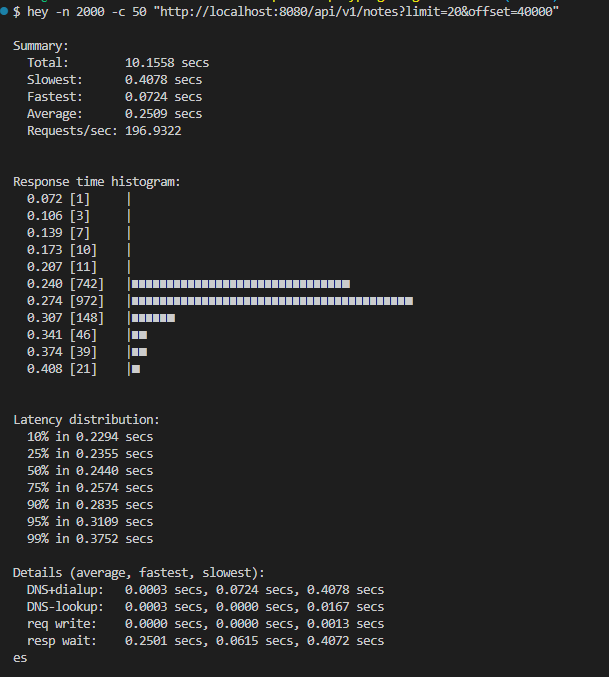
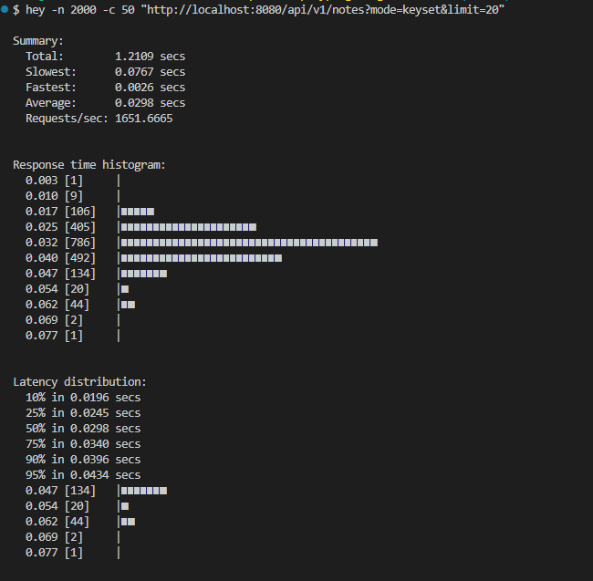
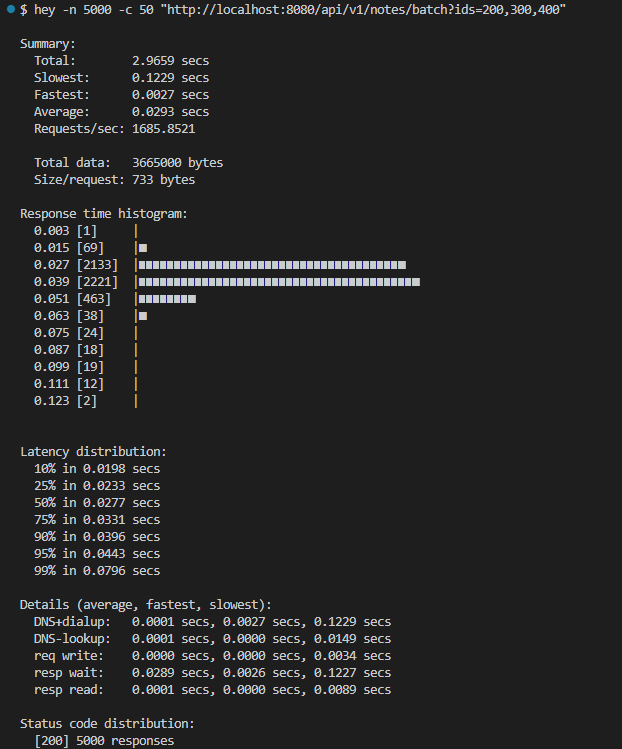

# Практическое занятие №14

## Тема: Оптимизация запросов к БД. Использование connection pool

**Студент:** Наумов А.Е.
**Группа:** ЭФМО-01-25

### Описание окружения:
База развернута с помощью docker-compose
```bash
docker-compose up -d
```

Структура БД:



### Описание используемых индексов



notes_pkey - Первичный ключ, автоматически создается для быстрого поиска по id.

idx_notes_title_gin - GIN-индекс для полнотекстового поиска по заголовку.

idx_notes_created_id - Составной B-tree индекс для keyset-пагинации (быстрая навигация created_at DESC, id DESC вместо медленного OFFSET).

### Заполнение таблицы случайными данными



### Планы запросов:
- Запрос с использованием стандартного OFFSET



- Запрос с keyset-пагинацией



Использование индекса idx_notes_created_id для поиска
Нет сортировки - данные уже отсортированы в индексе

- Батчинг



Один проход по индексу для всех ID

### Результаты нагрузочного тестирования
- offset пагинация
```
hey -n 2000 -c 50 "http://localhost:8080/api/v1/notes?limit=20&offset=40000"
```



RPS: 196.9
p95: 0.31s
p99: 0.375s
Error rate: 0%

- keyset пагинация



RPS: 1651.7
p95: 0.0434s
p99: 0.0587s
Error rate: 0%

- batch



RPS: 168
p95: 0.0443s
p99: 0.0796s
Error rate: 0%