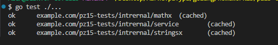
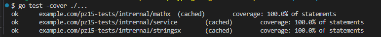
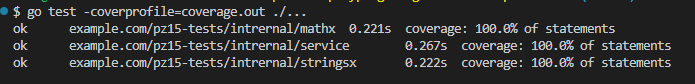
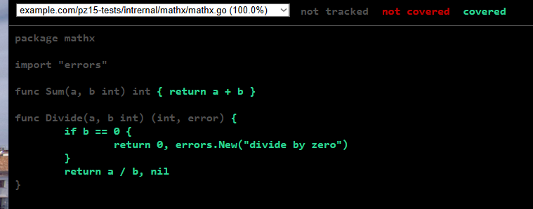
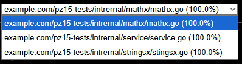
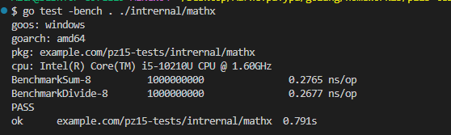

# Практическое занятие №15

## Тема: Unit-тестирование функций (testing, testify)

**Студент:** Наумов А.Е.
**Группа:** ЭФМО-01-25

### Цели
Освоить базовые приёмы unit-тестирования в Go с помощью стандартного пакета testing.
Научиться писать табличные тесты, подзадачи t.Run, тестировать ошибки и паники.
Освоить библиотеку утверждений testify (assert, require) для лаконичных проверок.
Научиться измерять покрытие кода (go test -cover) и формировать html-отчёт покрытия.
Подготовить минимальную структуру проектных тестов и общий чек-лист качества тестов.


### Команды запуска
```bash
go test ./... 
```



```bash
go test -cover ./... 
```



```bash
go test -coverprofile=coverage.out ./...
```



```bash
go tool cover -html=coverage.out  
```





```bash
go test -bench . ./intrernal/mathx
```


