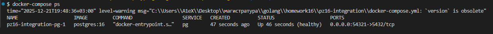
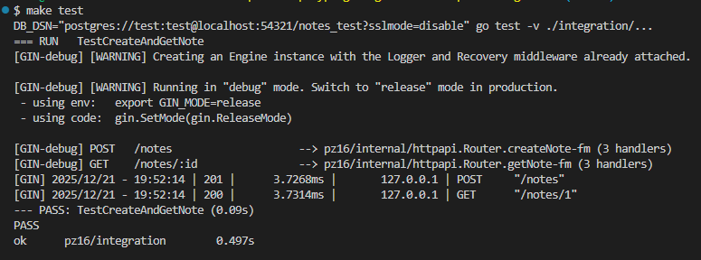

# Практическое занятие №16

## Тема: Интеграционное тестирование API. Использование Docker для тестовой БД

**Студент:** Наумов А.Е.
**Группа:** ЭФМО-01-25

## Подготовка окружения

```bash
make up
```



## Запуск тестов

```bash
make test
```



## Выводы
Проверили полный цикл работы приложения: создание заметки через POST-запрос и её получение через GET. Схема инициализировалась автоматически через миграции в коде теста, что обеспечивает чистоту окружения. Основная сложность - зависимость от внешнего сервиса, требующая поднятия контейнера перед тестами. Ограничение - тесты выполняются последовательно, нет параллельного запуска из-за общей тестовой БД.