# Отчёт по практической работе №17
## Микросервисная архитектура: Auth + Tasks

---

## 1. Запуск проекта

### Переменные окружения

| Переменная | Сервис | Значение по умолчанию |
|------------|--------|-----------------------|
| `AUTH_PORT` | Auth | `8081` |
| `TASKS_PORT` | Tasks | `8082` |
| `AUTH_BASE_URL` | Tasks | `http://localhost:8081` |

### Команды запуска

**Терминал 1 — Auth service:**
```bash
cd tech-ip-sem2/services/auth
AUTH_PORT=8081 go run ./cmd/auth
```

**Терминал 2 — Tasks service:**
```bash
cd tech-ip-sem2/services/tasks
TASKS_PORT=8082 AUTH_BASE_URL=http://localhost:8081 go run ./cmd/tasks
```

---

## 2. Границы сервисов

**Auth service** отвечает исключительно за аутентификацию: выдаёт токен по логину/паролю и проверяет его валидность. Сервис ничего не знает о задачах и не хранит бизнес-данных.

**Tasks service** реализует CRUD задач и хранит их в памяти. Перед выполнением любой операции он обращается к Auth service через HTTP-клиент с таймаутом 3 секунды. Если Auth недоступен — запрос отклоняется (fail-closed, 503). Если токен невалиден — возвращается 401.

Сервисы общаются только через HTTP-контракты и не импортируют код друг друга. Общий код (middleware, http-клиент) вынесен в пакет `shared/`.

---

## 3. Эндпоинты

### Auth service (`localhost:8081`)

#### POST /v1/auth/login — получить токен

```bash
curl -s -X POST http://localhost:8081/v1/auth/login \
  -H "Content-Type: application/json" \
  -H "X-Request-ID: req-001" \
  -d '{"username":"student","password":"student"}'
```

Ожидаемый ответ `200 OK`:
```json
{
  "access_token": "demo-token",
  "token_type": "Bearer"
}
```

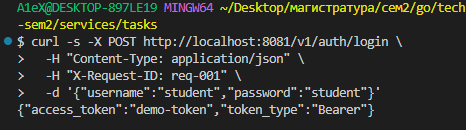

---

#### GET /v1/auth/verify — проверить токен

```bash
curl -i http://localhost:8081/v1/auth/verify \
  -H "Authorization: Bearer demo-token" \
  -H "X-Request-ID: req-002"
```

Ожидаемый ответ `200 OK`:
```json
{
  "valid": true,
  "subject": "student"
}
```

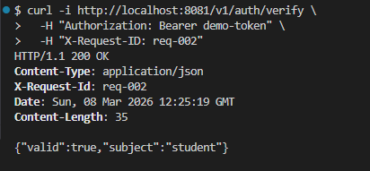

---

#### GET /v1/auth/verify — невалидный токен

```bash
curl -i http://localhost:8081/v1/auth/verify \
  -H "Authorization: Bearer wrong-token" \
  -H "X-Request-ID: req-002b"
```

Ожидаемый ответ `401 Unauthorized`:
```json
{
  "valid": false,
  "error": "unauthorized"
}
```

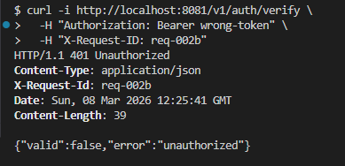

---

### Tasks service (`localhost:8082`)

#### POST /v1/tasks — создать задачу

```bash
curl -i -X POST http://localhost:8082/v1/tasks \
  -H "Content-Type: application/json" \
  -H "Authorization: Bearer demo-token" \
  -H "X-Request-ID: req-003" \
  -d '{"title":"Do PZ17","description":"split services","due_date":"2026-01-10"}'
```

Ожидаемый ответ `201 Created`:
```json
{
  "id": "t_001",
  "title": "Do PZ17",
  "description": "split services",
  "due_date": "2026-01-10",
  "done": false
}
```

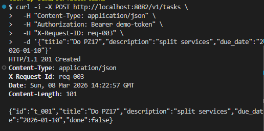

---

#### GET /v1/tasks — список задач

```bash
curl -i http://localhost:8082/v1/tasks \
  -H "Authorization: Bearer demo-token" \
  -H "X-Request-ID: req-004"
```

Ожидаемый ответ `200 OK`:
```json
[
  {"id":"t_001","title":"Do PZ17","done":false}
]
```

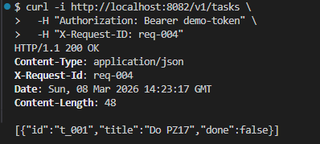

---

#### GET /v1/tasks/{id} — получить задачу по ID

```bash
curl -i http://localhost:8082/v1/tasks/t_001 \
  -H "Authorization: Bearer demo-token" \
  -H "X-Request-ID: req-005"
```

Ожидаемый ответ `200 OK`:
```json
{
  "id": "t_001",
  "title": "Do PZ17",
  "description": "split services",
  "due_date": "2026-01-10",
  "done": false
}
```

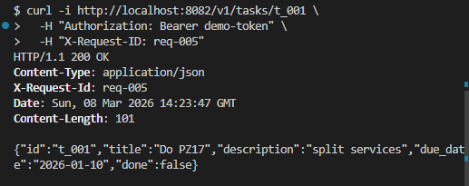
---

#### PATCH /v1/tasks/{id} — обновить задачу

```bash
curl -i -X PATCH http://localhost:8082/v1/tasks/t_001 \
  -H "Content-Type: application/json" \
  -H "Authorization: Bearer demo-token" \
  -H "X-Request-ID: req-006" \
  -d '{"done":true}'
```

Ожидаемый ответ `200 OK`:
```json
{
  "id": "t_001",
  "title": "Do PZ17",
  "description": "split services",
  "due_date": "2026-01-10",
  "done": true
}
```

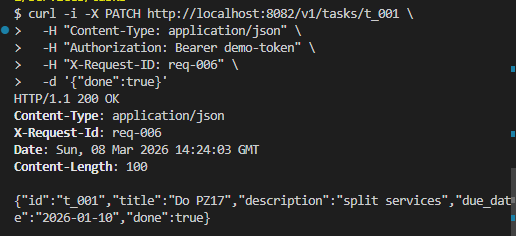

---

#### DELETE /v1/tasks/{id} — удалить задачу

```bash
curl -i -X DELETE http://localhost:8082/v1/tasks/t_001 \
  -H "Authorization: Bearer demo-token" \
  -H "X-Request-ID: req-007"
```

Ожидаемый ответ `204 No Content` (тело отсутствует).

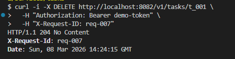

---

#### GET /v1/tasks — без токена (401)

```bash
curl -i http://localhost:8082/v1/tasks \
  -H "X-Request-ID: req-008"
```

Ожидаемый ответ `401 Unauthorized`:
```json
{
  "error": "missing authorization header"
}
```

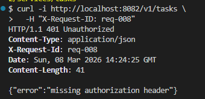

---

## 4. Прокидывание X-Request-ID

Middleware `RequestID` читает заголовок `X-Request-ID` из входящего запроса (или генерирует UUID если он отсутствует), передаёт дальше по цепочке. При вызове Auth service из Tasks клиент достаёт ID из контекста и добавляет его в исходящий запрос. В итоге один и тот же ID появляется в логах обоих сервисов.

**Запрос для демонстрации — создать задачу с фиксированным X-Request-ID:**

```bash
curl -i -X POST http://localhost:8082/v1/tasks \
  -H "Content-Type: application/json" \
  -H "Authorization: Bearer demo-token" \
  -H "X-Request-ID: trace-xyz-999" \
  -d '{"title":"trace test"}'
```

В логах Tasks и Auth появляется одна и та же строка `request_id=trace-xyz-999`:


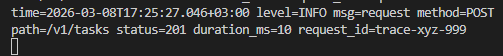

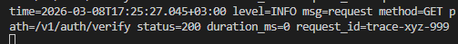
