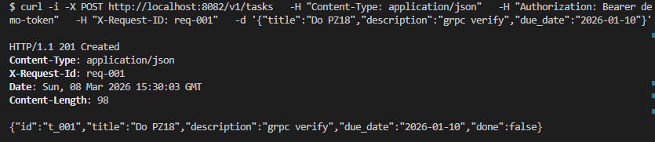
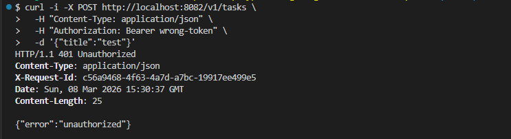
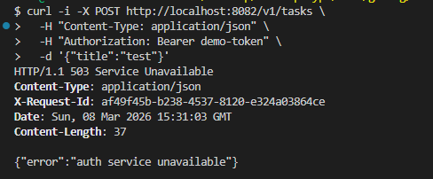

# Отчёт по практической работе №18
## gRPC: замена HTTP verify на gRPC verify

---

## 1. Запуск проекта

### Переменные окружения

| Переменная | Сервис | Значение по умолчанию |
|------------|--------|-----------------------|
| `AUTH_PORT` | Auth | `8081` |
| `AUTH_GRPC_PORT` | Auth | `50051` |
| `TASKS_PORT` | Tasks | `8082` |
| `AUTH_GRPC_ADDR` | Tasks | `localhost:50051` |

### Установка плагинов

```bash
go install google.golang.org/protobuf/cmd/protoc-gen-go@latest
go install google.golang.org/grpc/cmd/protoc-gen-go-grpc@latest
```

### Генерация кода из proto

Выполнять из корня проекта (`tech-ip-sem2/`):

```bash
protoc --go_out=gen/auth --go-grpc_out=gen/auth --proto_path=. proto/auth.proto
```

После генерации в `gen/auth/` появляются два файла:
- `auth.pb.go` — структуры `VerifyRequest` и `VerifyResponse`
- `auth_grpc.pb.go` — интерфейсы сервера и клиентский stub

### Скачать зависимости и проверить компиляцию

```bash
cd tech-ip-sem2
go mod tidy
go build ./...
```

### Команды запуска

**Терминал 1 — Auth service (HTTP + gRPC):**
```bash
cd services/auth
AUTH_PORT=8081 AUTH_GRPC_PORT=50051 go run ./cmd/auth
```

**Терминал 2 — Tasks service:**
```bash
cd services/tasks
TASKS_PORT=8082 AUTH_GRPC_ADDR=localhost:50051 go run ./cmd/tasks
```

---


## 2. Proto-файл

```protobuf
syntax = "proto3";

package auth;

option go_package = "tech-ip-sem2/gen/auth";

message VerifyRequest {
  string token = 1;
}

message VerifyResponse {
  bool   valid   = 1;
  string subject = 2;
}

service AuthService {
  rpc Verify(VerifyRequest) returns (VerifyResponse);
}
```


---

## 3. Основные эндпоинты


### POST /v1/tasks — создать задачу (verify идёт через gRPC)

```bash
curl -i -X POST http://localhost:8082/v1/tasks \
  -H "Content-Type: application/json" \
  -H "Authorization: Bearer demo-token" \
  -H "X-Request-ID: req-001" \
  -d '{"title":"Do PZ18","description":"grpc verify","due_date":"2026-01-10"}'
```

Ожидаемый ответ `201 Created`:
```json
{
  "id": "t_001",
  "title": "Do PZ18",
  "description": "grpc verify",
  "due_date": "2026-01-10",
  "done": false
}
```



---

### POST /v1/tasks — невалидный токен (401)

```bash
curl -i -X POST http://localhost:8082/v1/tasks \
  -H "Content-Type: application/json" \
  -H "Authorization: Bearer wrong-token" \
  -d '{"title":"test"}'
```

Ожидаемый ответ `401 Unauthorized`:
```json
{ "error": "unauthorized" }
```



---

### POST /v1/tasks — Auth недоступен (503)

```bash
# Остановить Auth service, затем:
curl -i -X POST http://localhost:8082/v1/tasks \
  -H "Content-Type: application/json" \
  -H "Authorization: Bearer demo-token" \
  -d '{"title":"test"}'
```

Ожидаемый ответ `503 Service Unavailable`:
```json
{ "error": "auth service unavailable" }
```



---

## 4. Ошибки gRPC и маппинг на HTTP статусы

gRPC использует собственные коды ошибок. В `authgrpc/client.go` они преобразуются в HTTP-статусы:

| gRPC код | Причина | HTTP статус |
|----------|---------|-------------|
| `OK` | токен валиден | `200` |
| `Unauthenticated` | токен неверный или пустой | `401` |
| `PermissionDenied` | токен есть, но доступ запрещён | `401` |
| `DeadlineExceeded` | Auth не ответил за 2 секунды | `503` |
| `Unavailable` | Auth недоступен / соединение отклонено | `503` |
| `Internal` | внутренняя ошибка Auth | `503` |

Логика маппинга в клиенте:

```go
switch status.Code(err) {
case codes.Unauthenticated, codes.PermissionDenied:
    return ErrUnauthorized   // → 401
default:
    return ErrUpstream       // → 503
}
```

---

## 5. Пример логов


### Auth недоступен (deadline exceeded)

```
# Терминал Tasks (через ~2 секунды после запроса):
time=2026-03-08T18:31:03.182+03:00 level=INFO msg=request method=POST path=/v1/tasks status=503 duration_ms=8 request_id=af49f45b-b238-4537-8120-e324a03864ce
```

Tasks не завис — через 2 секунды `context.WithTimeout` истёк, клиент получил `codes.DeadlineExceeded`, Tasks вернул `503`.
