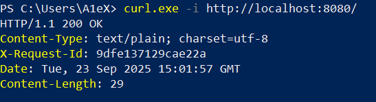
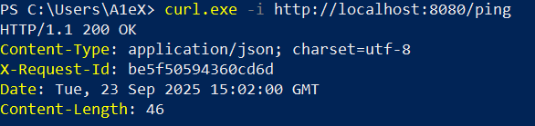
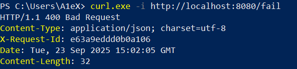

# Практическое занятие №2

## Тема: Структура Go-проекта

**Студент:** Наумов А.Е.
**Группа:** ЭФМО-01-25

### Запуск
1. Клонирование репозитория
```bash
git clone git@github.com:d1vide/golang.git
```
2. Переход в директорию проекта 
```bash
cd homework2/myapp/
```
3. Запуск приложения
   3.1. Запуск через `go run`
   ```bash
   go run ./cmd/server
   ```
   3.2. Запуск через `exe` файл
   Для сборки exe (необязательно)
    ```bash
    go build -o helloapi.exe ./cmd/server
    ```
    Для запуска файла
    ```bash
    ./helloapi.exe
    ```
# Описание проекта:
Простой HTTP API сервер на Go, предоставляющий базовые эндпоинты.
При обработке применяется middleware - добавляет или использует заголовок
X-Request-Id для каждого запроса.
## Примеры запросов:
### 1. GET /
`curl http://localhost:8080/`

### 2. GET /ping
`curl http://localhost:8080/ping`

### 3. GET /fail
`curl http://localhost:8080/fail`


Сервер будет доступен по адресу: `http://localhost:8080`
