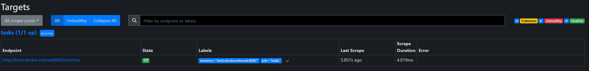
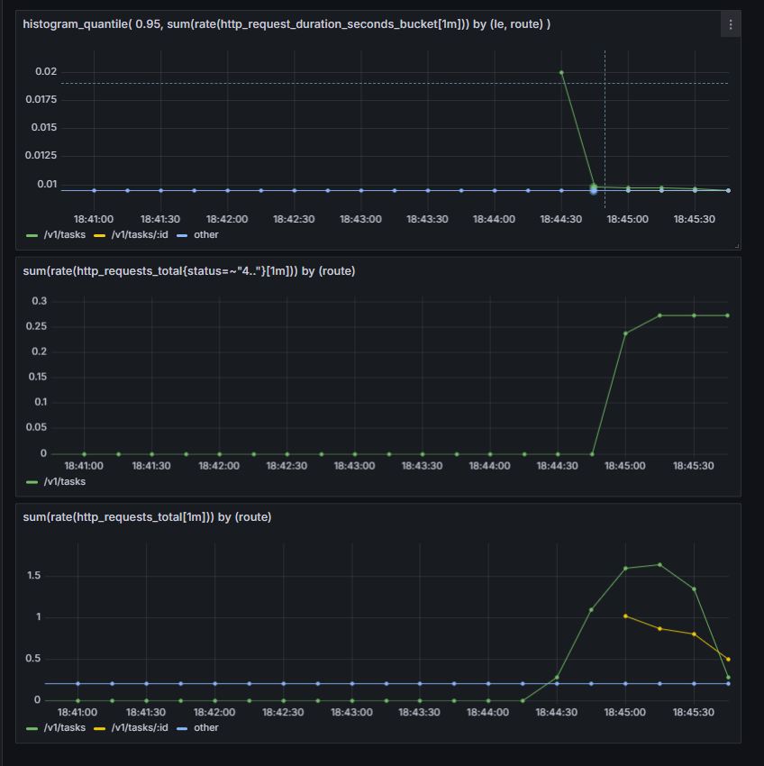

# Отчёт по практической работе №20
## Метрики: Prometheus + Grafana

---

## 1. Запуск всей связки

### Шаг 1 — запустить Tasks и Auth service

```bash
cd services/tasks
TASKS_PORT=8082 AUTH_BASE_URL=http://localhost:8081 go run ./cmd/tasks
AUTH_PORT=8081 go run ./cmd/auth
```

### Шаг 2 — поднять Prometheus и Grafana

```bash
cd deploy/monitoring
docker compose up -d
```

### Шаг 3 — проверить что метрики отдаются

```bash
curl -s http://localhost:8082/metrics | head -n 30
```

### Шаг 4 — нагрузить сервис для живых графиков

```bash
# 50 успешных запросов
for i in {1..50}; do
  curl -s http://localhost:8082/v1/tasks \
    -H "Authorization: Bearer demo-token" > /dev/null
done

# 20 запросов с неверным токеном (401)
for i in {1..20}; do
  curl -s http://localhost:8082/v1/tasks \
    -H "Authorization: Bearer wrong" > /dev/null
done
```

### Адреса

| Сервис | Адрес |
|--------|-------|
| Tasks metrics | http://localhost:8082/metrics |
| Prometheus | http://localhost:9090 |
| Grafana | http://localhost:3000 (admin / admin) |

---

## 2. Добавленные метрики

Метрики реализованы в `services/tasks/internal/http/metrics.go` и снимаются middleware в `middleware.go`.

### http_requests_total — Counter

Считает общее количество завершённых HTTP-запросов.

| Label | Значения | Описание |
|-------|----------|----------|
| `method` | `GET`, `POST`, `PATCH`, `DELETE` | HTTP метод |
| `route` | `/v1/tasks`, `/v1/tasks/:id`, `other` | нормализованный путь |
| `status` | `200`, `201`, `204`, `401`, `404`, `503` | HTTP статус ответа |

Пути нормализуются чтобы избежать высокой кардинальности: `/v1/tasks/t_001`, `/v1/tasks/t_002` и т.д. все превращаются в `/v1/tasks/:id`.

---

### http_request_duration_seconds — Histogram

Измеряет длительность каждого запроса в секундах.

| Label | Значения | Описание |
|-------|----------|----------|
| `method` | `GET`, `POST`, ... | HTTP метод |
| `route` | `/v1/tasks`, `/v1/tasks/:id`, `other` | нормализованный путь |

Bucket'ы: `0.01, 0.05, 0.1, 0.3, 1, 3` секунды — покрывают диапазон от быстрых in-memory ответов до медленных вызовов с таймаутом.

---

### http_in_flight_requests — Gauge

Текущее количество запросов в обработке в данный момент. Увеличивается при входе в handler, уменьшается при выходе. Labels отсутствуют.

---

## 3. Пример вывода /metrics

```
curl http://localhost:8082/metrics
# HELP http_in_flight_requests Current number of in-flight HTTP requests.
# TYPE http_in_flight_requests gauge
http_in_flight_requests 1

# HELP http_request_duration_seconds HTTP request duration in seconds.
# TYPE http_request_duration_seconds histogram
http_request_duration_seconds_bucket{method="GET",route="/v1/tasks",le="0.01"} 69
http_request_duration_seconds_bucket{method="GET",route="/v1/tasks",le="0.05"} 70
http_request_duration_seconds_bucket{method="GET",route="/v1/tasks",le="+Inf"} 70
http_request_duration_seconds_sum{method="GET",route="/v1/tasks"} 0.095
http_request_duration_seconds_count{method="GET",route="/v1/tasks"} 70

# HELP http_requests_total Total number of HTTP requests.
# TYPE http_requests_total counter
http_requests_total{method="GET",route="/v1/tasks",status="200"} 50
http_requests_total{method="GET",route="/v1/tasks",status="401"} 20
```


---

## 4. docker-compose и prometheus.yml

### deploy/monitoring/docker-compose.yml

Запускает два контейнера:

- **prometheus** — собирает метрики, порт `9090`. Монтирует `prometheus.yml` как конфиг.
- **grafana** — визуализация, порт `3000`. Монтирует папку `provisioning/` — datasource Prometheus подключается автоматически при старте.

### deploy/monitoring/prometheus.yml

```yaml
global:
  scrape_interval: 5s

scrape_configs:
  - job_name: tasks
    static_configs:
      - targets: ["host.docker.internal:8082"]
```

`scrape_interval: 5s` — Prometheus опрашивает `/metrics` каждые 5 секунд

`host.docker.internal:8082` — специальное DNS-имя которое внутри Docker контейнера резолвится в IP хост-машины. Это позволяет Prometheus достучаться до Tasks, запущенного локально без Docker. На Linux если `host.docker.internal` недоступен — заменить на LAN IP машины.

Проверка что target поднялся: `http://localhost:9090`



---

## 5. Графики в Grafana

Grafana: `http://localhost:3000`, логин `admin / admin`.
Datasource Prometheus подключается автоматически через provisioning.

---

### График 1 — RPS by route

**PromQL запрос:**
```promql
sum(rate(http_requests_total[1m])) by (route)
```

**Тип:** Time series. **Legend:** `{{route}}`

Показывает количество запросов в секунду отдельно для каждого route. После нагрузочного теста видна волна роста на `/v1/tasks`.


---

### График 2 — Errors (4xx / 5xx)

**Query A — 4xx:**
```promql
sum(rate(http_requests_total{status=~"4.."}[1m])) by (route)
```

**Query B — 5xx:**
```promql
sum(rate(http_requests_total{status=~"5.."}[1m])) by (route)
```

**Тип:** Time series. **Legend A:** `4xx {{route}}`, **Legend B:** `5xx {{route}}`

После 20 запросов с неверным токеном виден всплеск 4xx на `/v1/tasks`.


---

### График 3 — Latency p95

**PromQL запрос:**
```promql
histogram_quantile(
  0.95,
  sum(rate(http_request_duration_seconds_bucket[1m])) by (le, route)
)
```

**Тип:** Time series. **Unit:** seconds (s). **Legend:** `{{route}}`

p95 означает что 95% запросов завершаются быстрее этого значения.

other - запросы на сам /metrics от Prometheus

