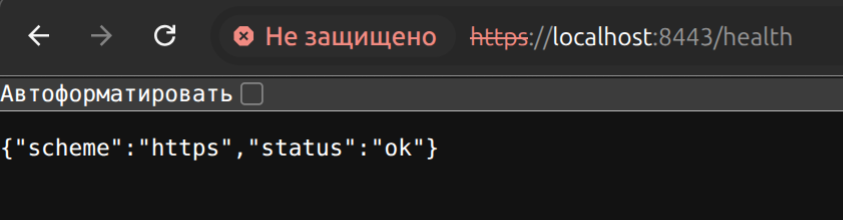
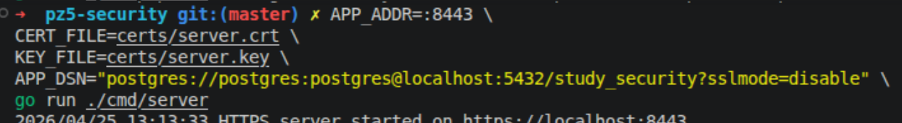
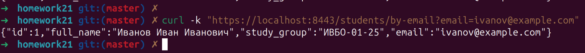
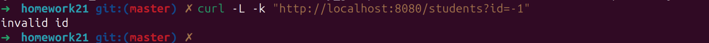

# Отчёт по практической работе №5
## Реализация HTTPS (TLS-сертификаты). Защита от SQL-инъекций

## Вариант 1. HTTPS Redirect

Был реализован отдельный HTTP сервер на порту 8080, который перенаправляет все запросы на HTTPS сервер 8443.

Проверка:
`http://localhost:8080/health`

Автоматический переход на:

`https://localhost:8443/health`
Скриншот браузера:

## Вариант 2. Конфигурация через ENV

Параметры приложения вынесены в переменные окружения:

APP_ADDR
CERT_FILE
KEY_FILE
APP_DSN

## Вариант 3. Поиск студента по email

Добавлен маршрут:

`GET /students/by-email?email=ivanov@example.com`

Использован параметризованный SQL запрос:

`WHERE email = $1`
Проверка:
curl -k "https://localhost:8443/students/by-email?email=ivanov@example.com"
Результат:

## Вариант 4. Allow-list validation

Добавлена проверка:

ID только положительное число
Пример ошибки:

