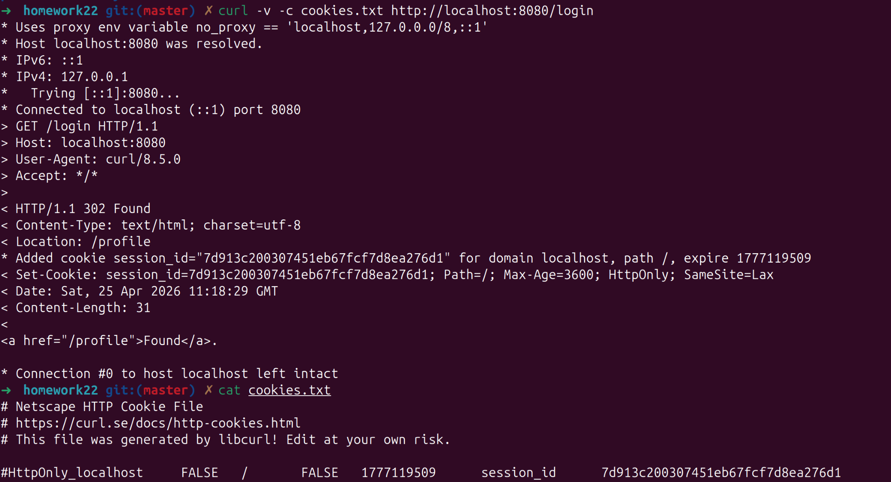
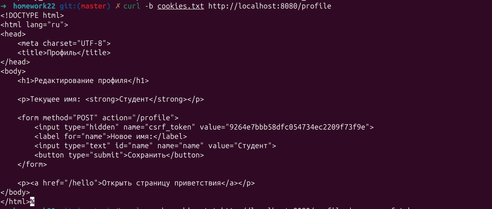
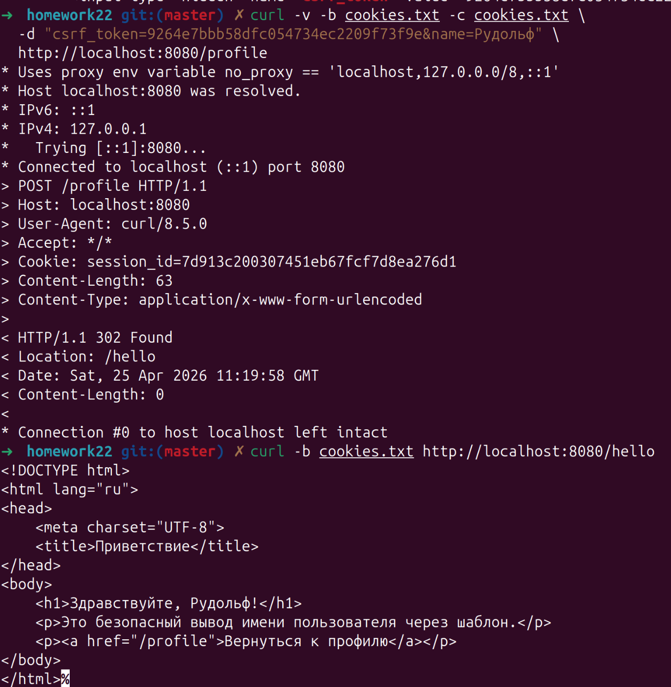
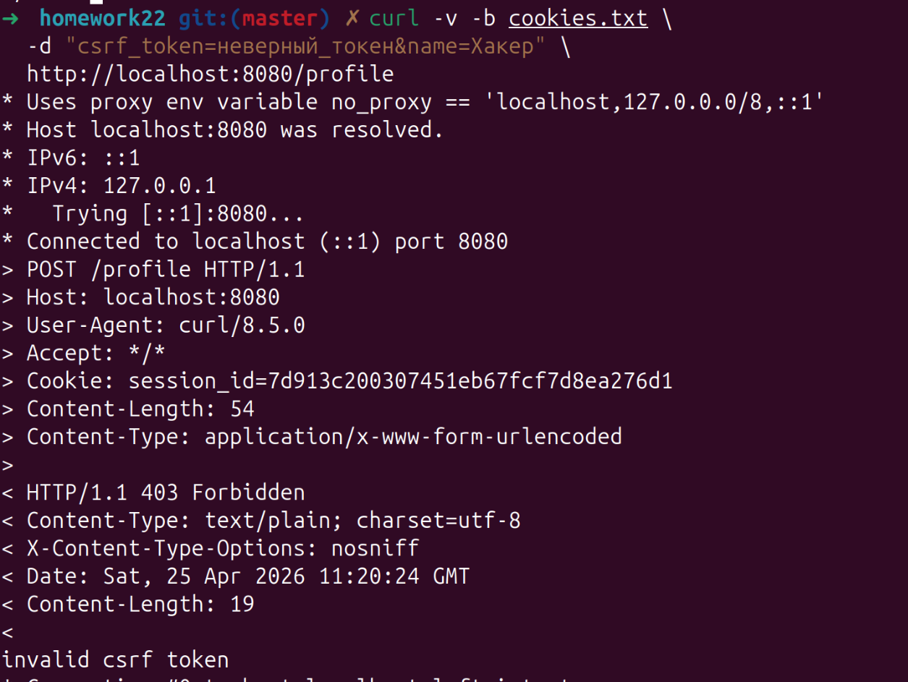
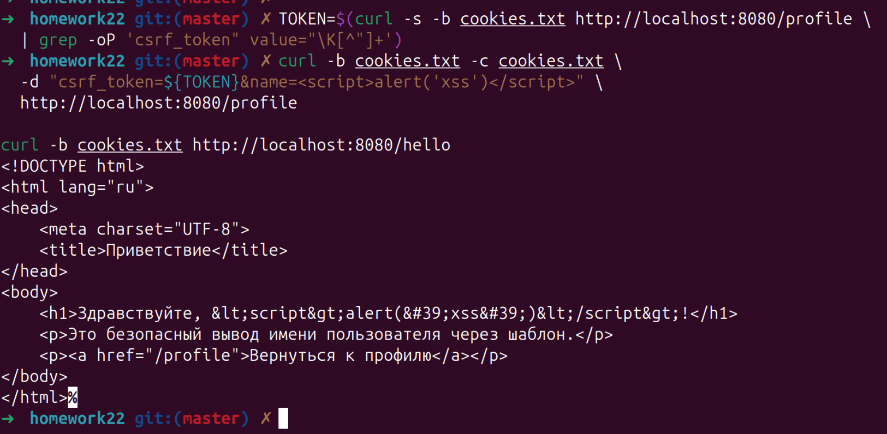
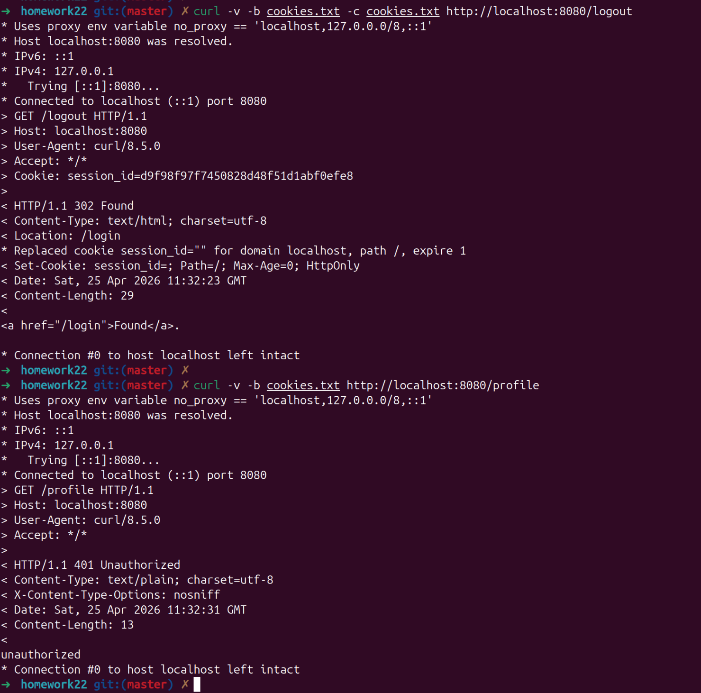
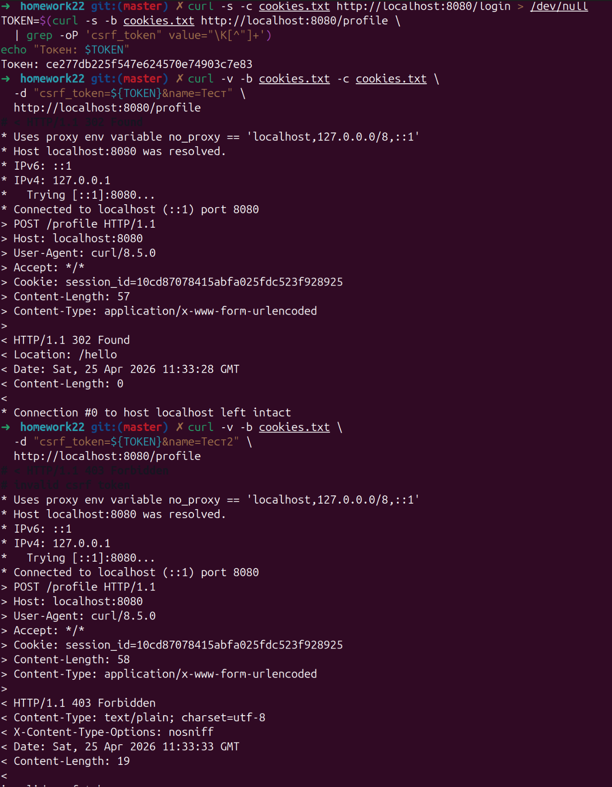
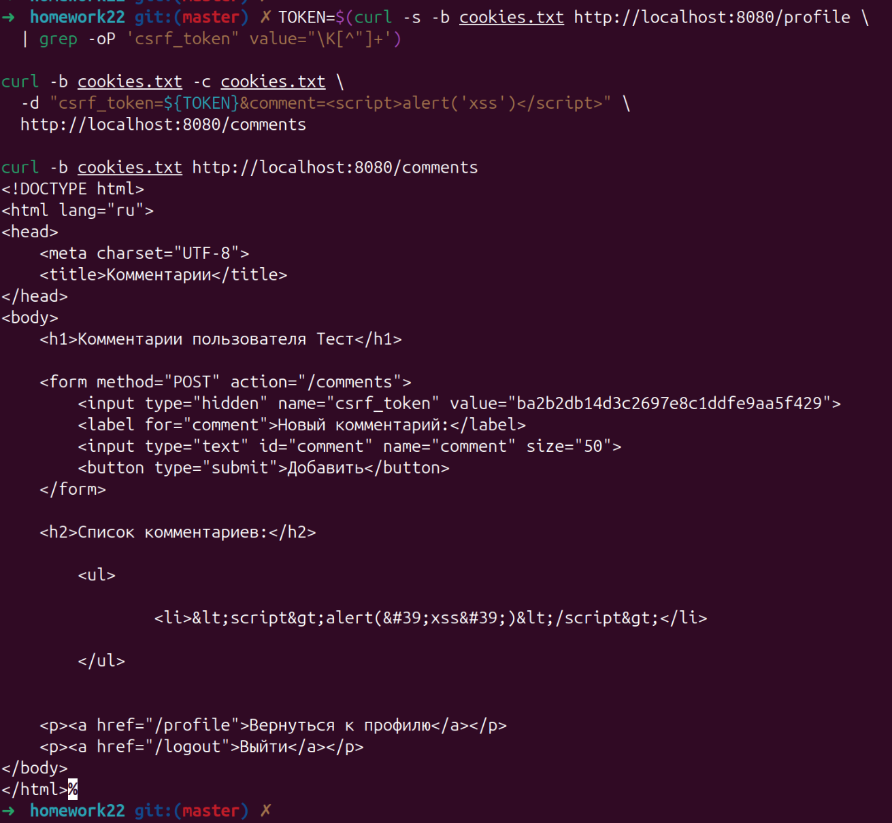

# Отчёт по практической работе №6
## Реализация защиты от CSRF/XSS. Работа с secure cookies


## 1. Тема и цель работы

**Тема:** Реализация защиты от CSRF/XSS. Работа с secure cookies.

**Цель:** Освоить базовые практические подходы к защите web-приложения на Go от CSRF- и XSS-угроз, а также научиться безопасно использовать cookies для аутентификации и хранения пользовательского состояния.

---

## 2. Что такое CSRF

CSRF (Cross-Site Request Forgery) — атака, при которой браузер пользователя отправляет запрос на целевой сервер без его осознанного намерения. Это возможно потому, что браузер автоматически прикладывает cookies к запросу. Сервер видит «авторизованный» запрос и выполняет действие, хотя пользователь его не инициировал.

Для защиты используется CSRF-токен: уникальное значение, встроенное в форму, которое сервер проверяет при обработке POST-запроса. Наличие одной только cookie больше не является достаточным условием для выполнения действия.

---

## 3. Что такое XSS

XSS (Cross-Site Scripting) — внедрение вредоносного клиентского кода (JavaScript) в страницу, которую затем увидит пользователь. Браузер интерпретирует содержимое не как текст, а как HTML или script.

Основная защита — использовать шаблоны, которые экранируют HTML автоматически, и не вставлять пользовательский ввод в страницу через конкатенацию строк.

---

## 4. Роль атрибутов cookie

- **HttpOnly** — запрещает чтение cookie из JavaScript. Снижает риск кражи cookie через XSS.
- **Secure** — браузер отправляет cookie только по HTTPS.
- **SameSite** — ограничивает передачу cookie в межсайтовых сценариях, уменьшая риск CSRF.


---

## 5. Дополнительные варианты — пояснение реализации

### Вариант 1 — Logout

Добавлен маршрут `GET /logout`. Обработчик `Logout` в `handler.go`:
1. Читает `session_id` из cookie.
2. Удаляет профиль из хранилища через `store.Delete(sessionID)`.
3. Затирает cookie через `ClearSessionCookie` (устанавливает `MaxAge: -1`).
4. Перенаправляет на `/login`.

После выхода повторный запрос на `/profile` вернёт **401 Unauthorized**, так как cookie очищена, а профиль удалён из store.

### Вариант 2 — Secure cookie

В `internal/auth/cookie.go` изменён один флаг:

```go
Secure: true,  // было false
```

Приложение запускается по HTTPS. При `Secure: true` и HTTP-соединении браузер **не отправляет** cookie — это ожидаемое и правильное поведение. Для локального тестирования по HTTP необходимо временно вернуть `Secure: false`.

### Вариант 3 — Ротация CSRF-токена

После успешного `POST /profile` обработчик генерирует новый CSRF-токен и сохраняет его в профиле:

```go
newToken, err := auth.RandomToken(16)
h.store.UpdateCSRFToken(sessionID, newToken)
```

Это означает, что если злоумышленник перехватил старый токен формы и пытается повторно его использовать — он получит **403 Forbidden**, потому что токен уже сменился после первого успешного запроса.

### Вариант 4 — Страница комментариев

Добавлены:
- Поле `Comments []string` в `UserProfile`.
- Метод `AddComment` в `store.go`.
- Шаблон `templates/comments.html` с формой и циклом `{{range .Comments}}`.
- Обработчик `Comments` в `handler.go` — GET рендерит список, POST проверяет CSRF-токен и добавляет комментарий.
- Маршрут `/comments` в `main.go`.

Шаблон `html/template` автоматически экранирует вывод, поэтому ввод `<script>alert('xss')</script>` отобразится как обычный текст, а не выполнится.

---

## 6. Результаты проверки

### 6.1 Переход на /login и установка cookie

В заголовках ответа виден Set-Cookie с флагами HttpOnly и SameSite=Lax, а в файле cookies.txt сохраняется session_id



### 6.2 Форма профиля с CSRF-токеном

В коде страницы виден токен



### 6.3 Успешное изменение имени

Сервер возвращает 302 Found с редиректом на /hello:



### 6.4 Ошибка при неверном CSRF-токене



### 6.5 Безопасное отображение script-тега (XSS не срабатывает)

Получаем новый токен. В ответе строка экранирована шаблоном — тег отображается как текст, а не исполняется:



### 6.6 Logout (Вариант 1)



### 6.7 Ротация CSRF-токена (Вариант 3)

Первый POST — успешный:
Второй POST — тот же токен, должен вернуть 403:



### 6.8 Страница комментариев с XSS-безопасным выводом (Вариант 4)

Комментарий экранирован шаблоном



