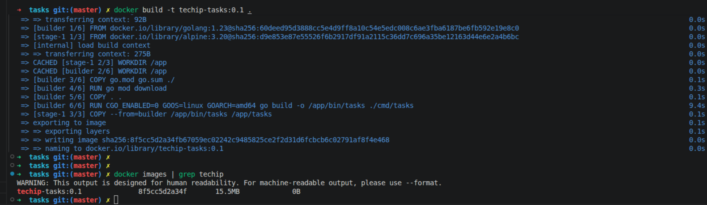
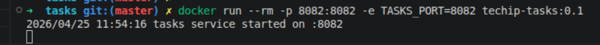
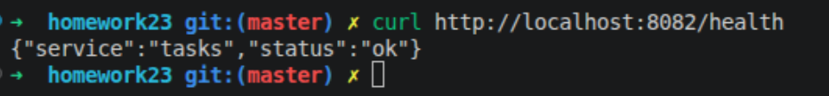
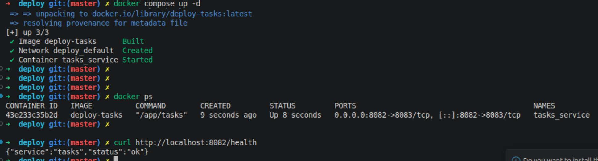

# Отчёт по практической работе №7
## Написание Dockerfile и сборка контейнера

## 1. Цель работы
Цель занятия
Освоить контейнеризацию backend-приложения на Go с помощью Docker, научиться писать Dockerfile, собирать Docker-образ и запускать контейнеризированный сервис в воспроизводимой среде.
---

Сборка образа

Старт контейнера с приксирование порта приложения 8082 на порт хоста 8082

Приложеие корректно работает

Поменяли значение порта по умолчанию для приложение на 8083, открыли его в Dockerfile но продолжили проксировать его на 8082 порт хоста. Приложение продолжило работать корректно

