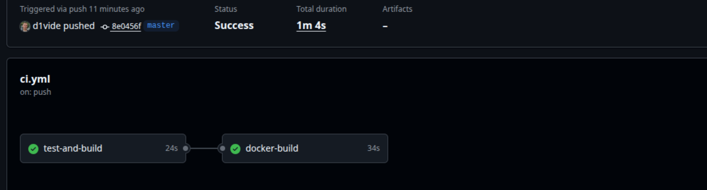
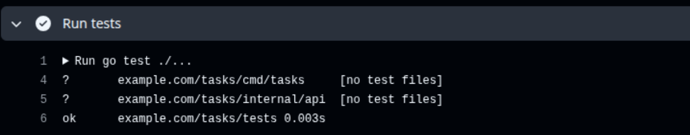
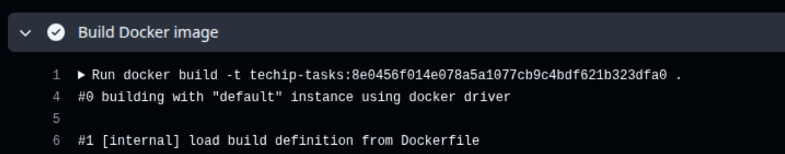

# Практическое занятие №8: Настройка CI/CD (GitHub Actions)

## Цель работы
Освоить основы CI/CD для backend-проекта на Go, научиться настраивать автоматический pipeline для проверки, сборки, упаковки Docker-образа и подготовки приложения к доставке.

---

## Теоретическая часть

### Что такое CI?
**Continuous Integration (CI)** — это практика непрерывной интеграции, при которой после каждого изменения кода система автоматически:
- Устанавливает зависимости
- Запускает тесты
- Выполняет сборку
- Проверяет, что проект не сломан

### Что такое CD?
**Continuous Delivery/Deployment (CD)** — автоматическая упаковка и доставка результата (публикация Docker-образа, деплой на сервер).

### Зачем нужен pipeline?
- Исключает ручные ошибки
- Автоматически проверяет работоспособность
- Обеспечивает воспроизводимую сборку
- Готовит проект к реальному деплою

---

## Выбранная платформа
**GitHub Actions** — встроенный инструмент CI/CD для репозиториев GitHub.

---

## Структура pipeline

Pipeline состоит из двух основных джобов (`jobs`):

| Джоб | Описание |
|------|----------|
| `test-and-build` | Проверка кода: установка Go, тесты, сборка |
| `docker-build` | Сборка Docker-образа после успешных тестов |

---

Хранение секретов (secrets)
Где должны храниться секреты?
В GitHub Secrets: Settings → Secrets and variables → Actions

Какие секреты могут потребоваться?
REGISTRY_USERNAME — имя пользователя в Docker registry

REGISTRY_PASSWORD — пароль или токен доступа

SSH_PRIVATE_KEY — приватный ключ для доступа к VPS

Чего НЕЛЬЗЯ делать?
- Коммитить секреты в репозиторий

- Писать пароли в открытом виде в .yml

- Хранить ключи в .env, который попадает в Git

Результат выполнения
Успешный запуск pipeline в GitHub Actions

