# Практическое занятие №3

## Тема: Реализация простого HTTP-сервера на стандартной библиотеке net/http. Обработка запросов GET/POST

**Студент:** Наумов А.Е.
**Группа:** ЭФМО-01-25

### Запуск
1. Клонирование репозитория
```bash
git clone git@github.com:d1vide/golang.git
```
2. Переход в директорию проекта 
```bash
cd homework3/pz3-http/
```
3. Запуск приложения
   3.1. Запуск через `go run`
   ```bash
   go run ./cmd/server/
   ```
# Описание проекта:
Простой HTTP API сервер на Go, предоставляющий базовые эндпоинты.

## Примеры ответов на запросы
1. Создание таски

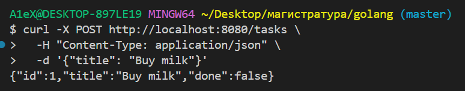

2. Просмотр списка тасок

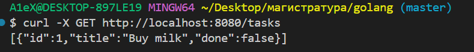

3. Просмотр конкретной таски

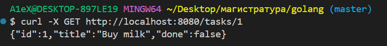

4. Изменение поля done таски

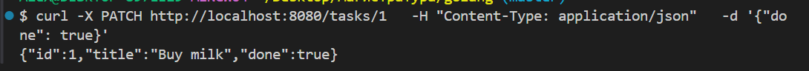

5. Проверка изменения поля

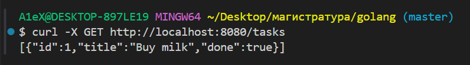

6. Удаление таски

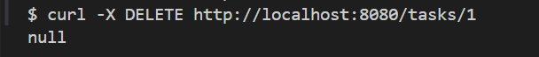

7. Проверка удаления тасок

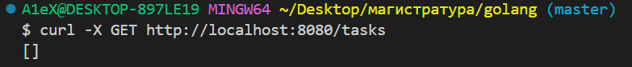

8. Проверка удаления таски

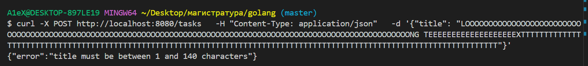

9. Проверка возможности done: false для таски

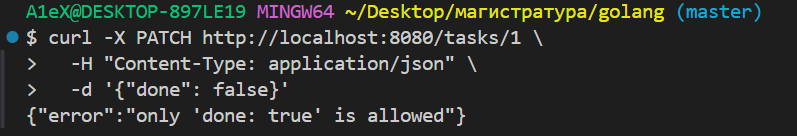

(копипасты для curl запросов в `requests.md`)

## CORS
С помощью middleware реализовано добавление заголовка для проверка CORS

Тестирование:
Написан index.html делающий запрос на /health
В коде middleware захардкожено значение хоста для страницы:
`w.Header().Set("Access-Control-Allow-Origin", "http://127.0.0.1:5500")`

В такой реализации результат будет корректно возвращаться только для адреса `127.0.0.1` но не для `localhost`

`127.0.0.1`

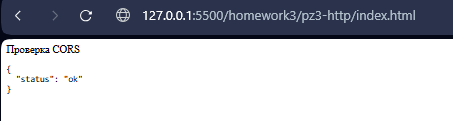

`localhost`

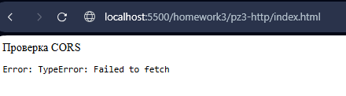


## Graceful shutdown
Обеспечивает плавное завершение работы сервера без обрыва текущих соединений

Обрабатываемые сигналы:
- SIGINT - прерывание от пользователя
- SIGTERM - запрос на завершение от системы

Контекст задает таймаут 30 секунд на graceful shutdown:
- Сервер перестает принимать новые запросы
- Ждет завершения активных обработчиков (30 сек)
- Если не успевает - принудительно закрывает оставшиеся соединения


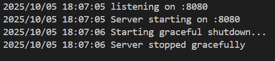
