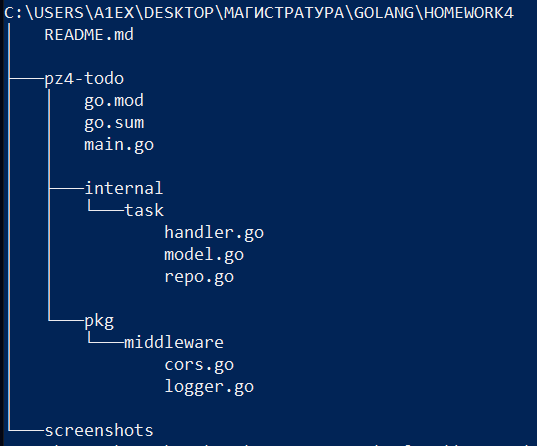
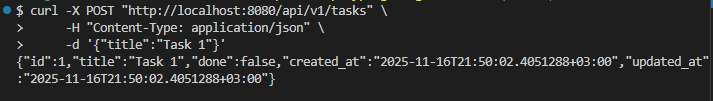
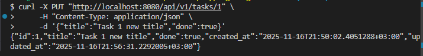
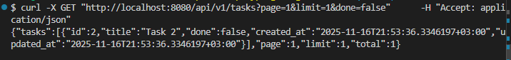
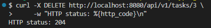

# Практическое занятие №4

## Тема: Маршрутизация с chi (альтернатива — gorilla/mux). Создание небольшого CRUD-сервиса «Список задач».

**Студент:** Наумов А.Е.
**Группа:** ЭФМО-01-25

Цель работы: освоить работу с роутером chi


## Ход работы:
1. Структура

2. Примеры работы эндпоинтов:
- POST `/tasks`
Создание таски и сохранение в файле


Содержимое файла database.json
```json
[
  {
    "id": 1,
    "title": "Task 1",
    "done": false,
    "created_at": "2025-11-16T21:50:02.4051288+03:00",
    "updated_at": "2025-11-16T21:50:02.4051288+03:00"
  }
]
```

- PUT `/tasks/{id}`
Обновление содержимого таски по id

Файл
```json
[
  {
    "id": 1,
    "title": "Task 1 new title",
    "done": true,
    "created_at": "2025-11-16T21:50:02.4051288+03:00",
    "updated_at": "2025-11-16T21:56:31.2292005+03:00"
  }
]
```

- GET `/tasks/{id}`
Получение таски по id


- GET `/tasks`
Получение списка тасок
Параметры:
    - page - номер страницы (по умолчанию 1)
    - limit - количество задач на страницу (по умолчанию 10)
    - done - фильтр по выполненным задачам


- DELETE `/tasks/{id}`
Удаление таски по id

3. Описание работы с файловым хранилищем

При выполнении всех модифицирующих запросов выполняется сохранение в файл
```go
func (r *Repo) save() {
	tasks := make([]*Task, 0, len(r.items))
	for _, task := range r.items {
		tasks = append(tasks, task)
	}

	data, _ := json.MarshalIndent(tasks, "", "  ")
	os.WriteFile(r.file, data, 0644)
}
```

При инициализации объекта репозитория происходит загрузка тасок из файла в map

```go
	if data, err := os.ReadFile(filename); err == nil {
		var tasks []*Task
		if json.Unmarshal(data, &tasks) == nil {
			for _, task := range tasks {
				repo.items[task.ID] = task
				if task.ID > repo.seq {
					repo.seq = task.ID
				}
			}
		}
	}

```

Также реализовано версионирование эндпоинтов
```go
	r.Route("/api", func(api chi.Router) {
		api.Route("/v1", func(v1 chi.Router) {
			v1.Mount("/tasks", h.Routes())
		})
	})
```

Вывод: в ходе выполнения практической работы были получены уменя пользования
роутером chi, а также навыки работы с текстовыми файлами  