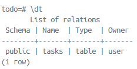
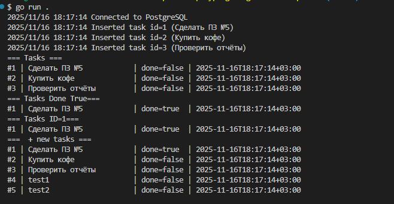
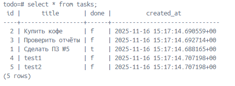

# Практическое занятие №5

## Тема: Подключение к PostgreSQL через database/sql. Выполнение простых запросов (INSERT, SELECT)

**Студент:** Наумов А.Е.
**Группа:** ЭФМО-01-25

1. Подготовка окружения
Старт контейнера с PostgreSQL
```bash
docker run -d \
  --name postgres-go \
  -e POSTGRES_PASSWORD=password \
  -e POSTGRES_USER=user \
  -e POSTGRES_DB=todo \
  -p 5432:5432 \
  -v postgres-data:/var/lib/postgresql/data \
  postgres
```
Примечение: удостовериться что порт 5432 не занят

для Windows
`netstat -ano | findstr :5432`

Создать таблицу в базе:
```sql
CREATE TABLE IF NOT EXISTS tasks (
  id         SERIAL PRIMARY KEY,
  title      TEXT        NOT NULL,
  done       BOOLEAN     NOT NULL DEFAULT FALSE,
  created_at TIMESTAMPTZ NOT NULL DEFAULT NOW()
);
```


Описание:
Проект описывающий прмимер взаимодействия выполнения raw запросов в БД из кода.
В main.go используется один объект контекста для повышения читаемости и поскольку проект учебный + вся работа выполняется последовательно в рамках одного сценария, в одном потоке и нет необходимости
задавать отдельный таймаут или логику отмены для каждого запроса к бд.

## Результат вывода программы:

Содержимое таблицы Tasks:


## Код
Новые методы репозитория:
```go
func (r *Repo) ListDone(ctx context.Context, done bool) ([]Task, error) {
	const q = `SELECT id, title, done, created_at FROM tasks WHERE done=$1 ORDER BY id;`

	rows, err := r.DB.QueryContext(ctx, q, done)

	if err != nil {
		return nil, err
	}
	defer rows.Close()

	var out []Task

	for rows.Next() {
		var t Task
		if err := rows.Scan(&t.ID, &t.Title, &t.Done, &t.CreatedAt); err != nil {
			return nil, err
		}
		out = append(out, t)
	}

	return out, rows.Err()
}

func (r *Repo) MarkTaskDone(ctx context.Context, id int) error {
	const q = `UPDATE tasks SET done = TRUE WHERE id = $1;`
	_, err := r.DB.ExecContext(ctx, q, id)
	return err
}

func (r *Repo) FindByID(ctx context.Context, id int) (*Task, error) {
	const q = `SELECT id, title, done, created_at FROM tasks WHERE id=$1;`
	var t Task

	err := r.DB.QueryRowContext(ctx, q, strconv.Itoa(id)).Scan(&t.ID, &t.Title, &t.Done, &t.CreatedAt)

	if err != nil {
		return nil, err
	}

	return &t, nil
}

func (r *Repo) CreateMany(ctx context.Context, titles []string) error {
	if len(titles) == 0 {
		return nil
	}

	tx, err := r.DB.BeginTx(ctx, nil)
	if err != nil {
		return err
	}
	defer tx.Rollback()

	const q = `INSERT INTO tasks (title) VALUES ($1);`

	for _, title := range titles {
		_, err := tx.ExecContext(ctx, q, title)
		if err != nil {
			return err
		}
	}

	if err := tx.Commit(); err != nil {
		return err
	}

	return nil
}
```

## Ответы на контрольные вопросы:
1. Что такое пул соединений *sql.DB и зачем его настраивать?
Объект для управления открытыми соединениями. Позволяет их ограничить нагрузку
на БД, уменьшать задержки на открытие новых соединений итд 
2. Почему используем плейсхолдеры $1, $2?
Защищают от SQL инъекций, позволяют передавать параметры безопасно без ручного
конкатенирования строк
3. Чем Query, QueryRow и Exec отличаются?
- Exec - выполняет запрос без возврата строк, возвращает только результат выполнения
- Query - выполняет запрос и возвращает несколько строк (*Rows), подходит для select
- QueryRow - выполняет запрос и возвращает одну строку, удобно для RETURNING

## Обоснование настроек пула
`MaxOpenConns = 10`
приложение небольшое, запросы лёгкие, и больше десяти параллельных соединений точно не потребуется
`MaxIdleConns = 5`
половина от максимума: столько достаточно, чтобы избежать задержек на создание новых соединений и не держать пул слишком большим
`ConnMaxLifetime = 30мин` 
соединения обновляются не так часто, чтобы не создавать лишних переподключений, но и не висят часами