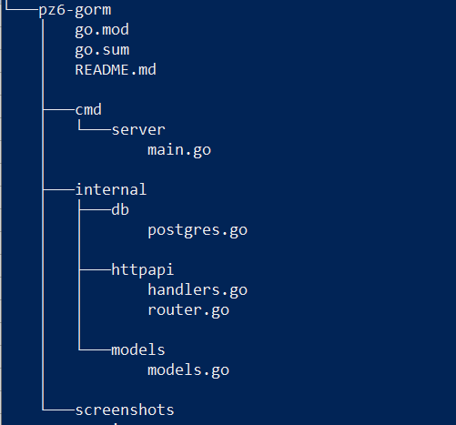
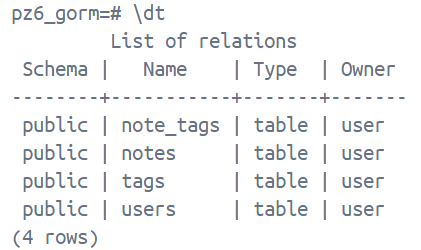
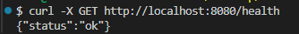
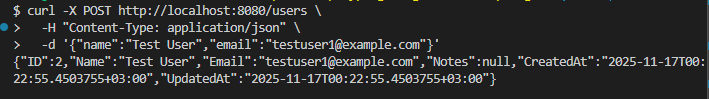
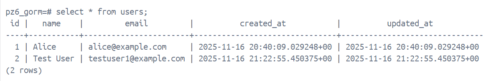
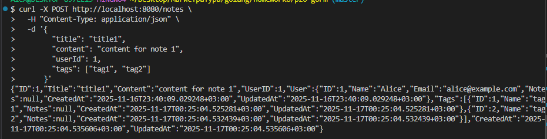
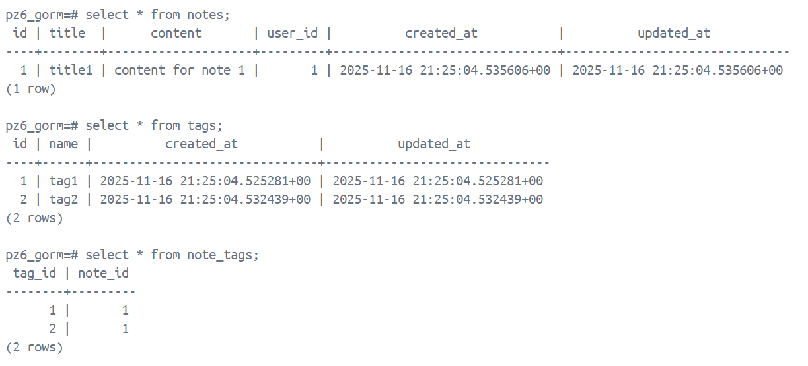
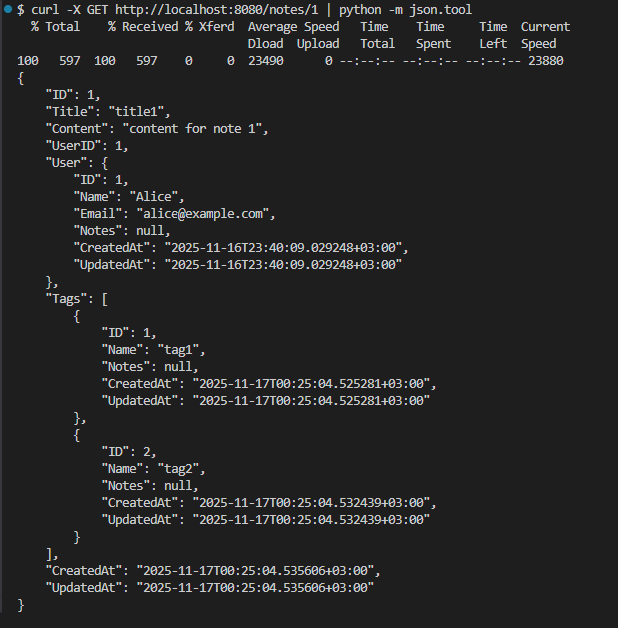

# Практическое занятие №6

## Тема: Использование ORM (GORM). Модели, миграции и связи между таблицами

**Студент:** Наумов А.Е.
**Группа:** ЭФМО-01-25


## Подготовка окружения

Переменные окружения:
```bash
export DB_DSN='host=127.0.0.1 user=user password=password dbname=pz6_gorm port=5432 sslmode=disable'
```

Контейнер с PostgreSQL
```bash
docker run -d --rm \
  --name postgres-go \
  -e POSTGRES_PASSWORD=password \
  -e POSTGRES_USER=user \
  -e POSTGRES_DB=pz6_gorm \
  -p 5432:5432 \
  -v postgres-go2-data:/var/lib/postgresql/data \
  postgres
```

## Зачем нужен ORM
ORM позволяет работать с БД как с объектами из кода, избавляя от ручного написания SQL запросов. GORM - популярная ORM для языка Go. Поддерживает множество баз данных и интегрируется с Go-структурами, автоматически преобразуя их в таблицы и записи в таблице. Благодаря ORM код становится чище, а его поддержка упрощается.

## Структура приложения



## Структура БД



## Примеры запросов
- GET `/health`
Проверка здоровья приложения



- POST `/users`
Создание пользователя



В таблице users:



- POST `/notes`
Создание заметки



В БД:



- GET `/notes/{id}`
Получение заметки по id



