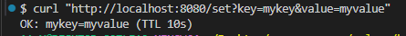
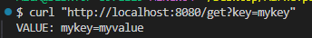
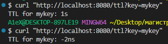
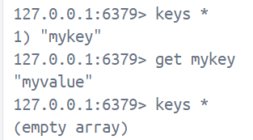

# Практическое занятие №7

## Тема: Подключение и работа с Redis (set/get, TTL). Реализация простого кэша.

**Студент:** Наумов А.Е.
**Группа:** ЭФМО-01-25


## Подготовка окружения

Контейнер с Redis
```bash
docker run -d --rm \
  --name redis-go \
  -p 6379:6379 \
  redis
```

## Примеры запросов
- `/set`
Установить значения для ключа (ttl 10 сек)



- `/get`
Получить значение ключа



- `/ttl`
Посмотреть ttl для ключа. Как ttl проходит, ключ удаляется (redis возвращает -2)



## Как ключи лежат в Redis



## Краткое описание
Redis - быстрая in-memory БД типа ключ-значение, часто используемая как кэш,
брокер очередей или хранилище сессий. Позволяет ускорить доступ к часто используемым данным, снижая нагрузку на основную БД.
TTL (Time To Live) задаёт время жизни записи в Redis, после его истечения данные автоматически удаляются.