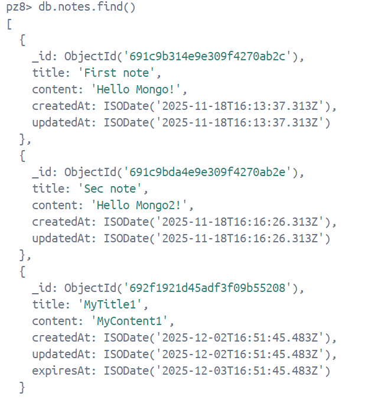
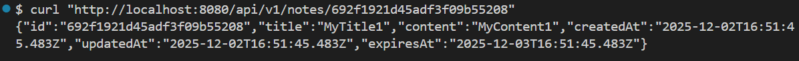
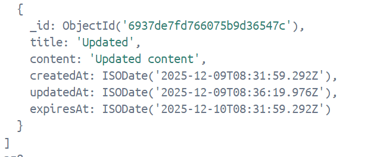
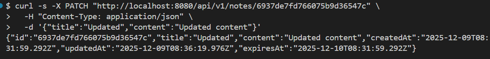
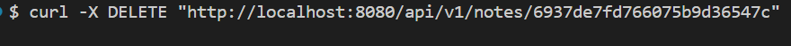
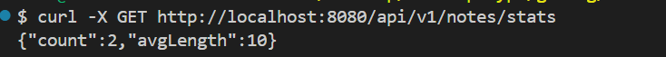
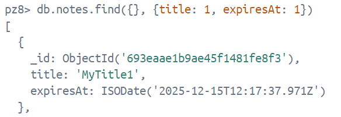

# Практическое занятие №8

## Тема: Работа с MongoDB: подключение, создание коллекции, CRUD-операции

**Студент:** Наумов А.Е.
**Группа:** ЭФМО-01-25


## Подготовка окружения

Контейнер с MongoDB
```bash
docker compose up -d
```

## Примеры запросов

- POST `/api/v1/notes`

```bash
curl -X POST http://localhost:8080/api/v1/notes \
  -H "Accept: application/json" \
  -d '{"title":"MyTitle1","content":"MyContent1"}'
```

В MongoDB коллекции notes:


- GET `/api/v1/notes`
```bash
curl "http://localhost:8080/api/v1/notes"
```


- GET `/api/v1/notes/{id}`



- PATCH `/api/v1/notes/{id}`





- DELETE `/api/v1/notes/{id}`



Запись успешно удалена


### Дополнительные задания

- GET `api/v1/notes?q=MyContent1`


- GET `/api/v1/notes/stats`



- TTL
Объекты создаются с TTL (24 часа по умолчанию)

